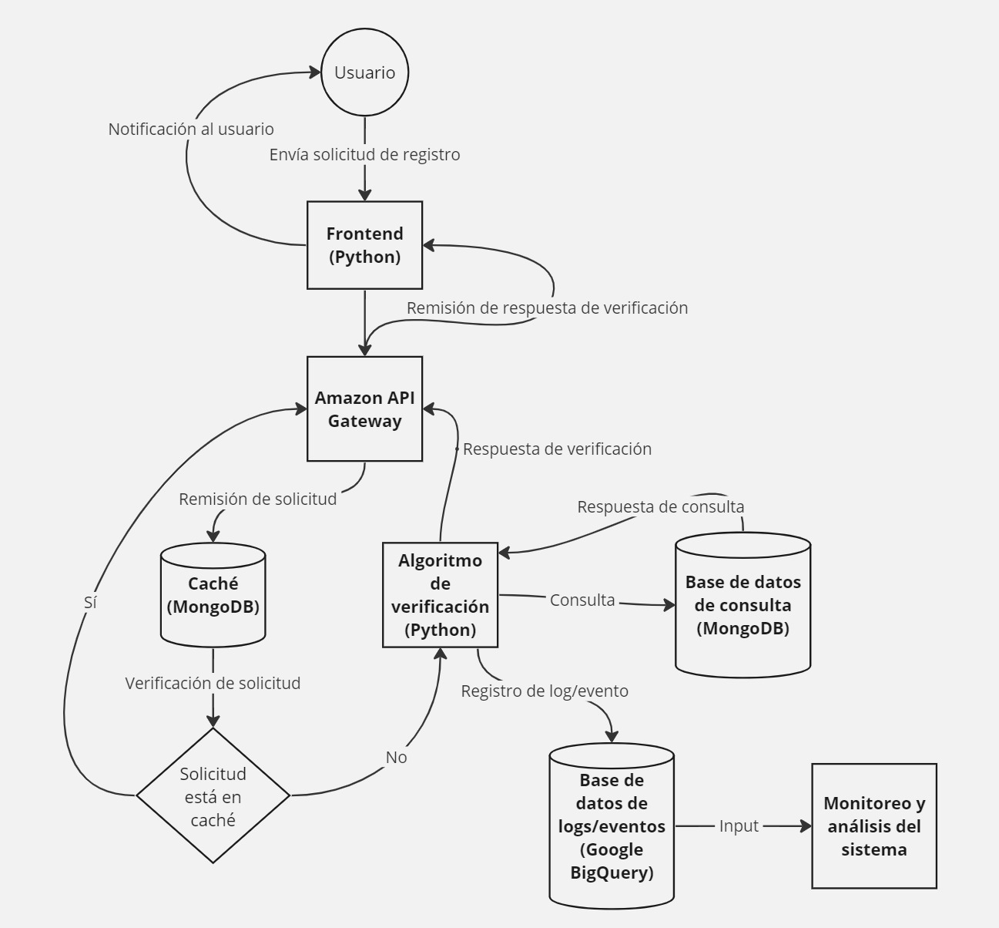

# Ejercicio 3

## Preliminares

Para la construcción del sistema de screening de nombres de usuario, se parte de la misma metodología utilizada en el desarrollo del **Ejercicio 2**, con algunas consideraciones:

 * El nombre ingresado por el usuario en el formulario del Frontend ya no será para realizar una comparación directa, sino para crear una solicitud de registro en la plataforma en línea descrita.
 * El umbral de similitud ya no puede ser definido por el usuario. Debe ser una característica intrínseca del sistema para poder permitir o desestimar usuarios en el registro, y, a su vez, puede ser el máximo grado de discriminación ($100\%$ de similitud), si se requiere desestimar matches exactos.
 * El dataset de comparación no puede ser ya un archivo plano fijo, sino que debe provenir de una de base de datos productiva, actualizada y mantenida periódicamente para este propósito.
 * Dado que se requiere de resguardar la información de los nombres comprometidos, la cual es confidencial, el output ya no será una lista de matches y su similitud, sino una respuesta binaria (positiva o negativa) de acuerdo a si es posible o no efectuar su registro de acuerdo a su entrada.

## Paso a paso simplificado del sistema

1. El usuario final del servicio ingresa un nombre desde un formulario de registro.
2. Se crea la solicitud de evaluación del nombre ingresado.
3. La solicitud va un algoritmo previamente modularizado para realizar la evaluación del nombre ingresado.
4. El algoritmo crea una solicitud de consulta en un motor de base de datos para determinar los nombres comprometidos y calcula si el ingresado hace match o no con alguno de los que se encuentran alojados allí.
5. Se genera una respuesta al usuario: si es positiva (no hay match con alguno de los nombres comprometidos), permite su registro; y, si es negativa, genera un mensaje de error. En ambos casos, crea un registro en base de datos del evento generado.

A continuación, se muestra un diagrama de lo anteriormente descrito.

## Arquitectura, tecnologías, diseño y consideraciones generales

Se escoge una arquitectura en nube para el sistema, basada en microservicios, de manera que el desarrollo, la vigilancia y el mantenimiento pueda realizarse independiente y paralelamente en todas sus componentes.

Dicha arquitectura está compuesta de los siguientes microservicios:

1. **Recepción de solicitudes:** Si bien es funcional el diseño de recepción de solicitudes desarrollado en el **Ejercicio 2** de este challenge, no es largamente escalable, pues se espera periodos de larga afluencia de usuarios haciendo solicitudes de registro de manera simultánea. Por esta razón, se escoge el servicio de Amazon API Gateway, el cual funciona como único punto de entrada para todas las solicitudes que puedan realizar los usuarios y, también, único punto de salida de este a los demás microservicios del flujo, y posee escalamiento automático ante aumentos en el tráfico.
2. **Verificación de nombres:** La aplicación de verificación de nombres de usuarios se desarrolla utilizando Python, principalmente apoyado de sus librerías de ciencia de datos y Big Data (NumPy, Pandas, PySpark, etc.) y Flask para la comunicación con API Gateway. Se prioriza el enfoque de BigData utilizando PySpark para el tratamiento de una mayor cantidad de datos y de funciones lambda y de métodos de mapeo para optimizar el rendimiento al realizar algunas de sus operaciones iterativas.
3. **Búsqueda en base de datos de nombres comprometidos:** Esta base de datos se sugiere que sea MongoDB, pues permite el escalamiento horizontal realizando sharding para dividir las cargas de datos en varios servidores (a gran diferencia de las bases de datos SQL, que proporcionan generalmente sólo escalamiento vertical). Además, el estructuramiento de la información en bases de datos NoSQL, además de la naturaleza de los datos a analizar (texto) es más afín a lenguajes de programación orientados a objetos, como es el caso de la estructura de un JSON, lo cual proporcionará un rendimiento superior en las lecturas. Si se desea escoger un servicio en nube de DWH SQL, como Snowflake o Google BigQuery, se recomienda trabajar únicamente con tablas de dimensión de usuarios que estén diseñadas únicamente para el propósito de este sistema, como se mencionó en las consideraciones iniciales.
4. **Caché:** La inclusión de un microservicio de caché es requerida para reducir la carga en el servicio cuando se realiza un porcentaje alto de solicitudes de registro similares. Se escoge también MongoDB para la gestión y almacenamiento de esta información, pues las solicitudes a ella serán análogas y paralelas a las consultas del punto anterior.
5. **Registro de eventos:** El registro de eventos se realiza en Google BigQuery, un DWH en nube de tipo relacional, pues su capacidad de almacenamiento y estructuración de la información es más legible y escalable para temas de auditoría y análisis, que son los directamente involucrados a su funcionamiento.
6. **Notificaciones y alertas:** Este microservicio se construye utilizando Python y Flask con API Gateway, complementado con la información de logs y eventos presente en Google BigQuery (descrita en el punto anterior), para proporcionar la respuesta del microservicio de verificación de nombres al usuario final y alertar a los desarrolladores y mantenedores del sistema ante cualquier eventualidad. Se propone también la construcción de métricas que puedan monitorearse a través de herramientas de visualización de datos como Looker, y la creación de alarmas usando Apache Airflow que se disparen apenas se detecten comportamientos anómalos en éstas y notifiquen a los mantenedores y administradores del sistema.

## Producción y despliegue

Se propone el uso de Docker para la automatización del despliegue de los componentes del sistema en ECR de AWS, para:

* Facilitar la integración del entorno por la cantidad de herramientas del mismo servicio de nube que posee el sistema.
* Portabilidad del sistema, mediante el encapsulamiento del mismo y sus dependencias.
* Aislamiento y bajo consumo de recursos de máquina.
* Escalamiento horizontal, al poder agregar o eliminar contenedores de acuerdo a la demanda.

A continuación se muestra un diagrama detallado de arquitectura del sistema propuesto:

## Disponibilidad y escalabilidad

El despliegue del sistema en un ambiente productivo en nube proporciona disponibilidad constante del servicio y una fiabilidad de mantenibilidad ante la constante evolución de sus herramientas. La escalabilidad horizontal del sistema está garantizada por las siguientes características:

*  Amazon API Gateway posee un equilibrador de carga automático ante aumentos de tráfico repentinos, usando Elastic Load Balancing. El enrutamiento siempre prioriza destinos con disponibilidad para evitar fallas en el servicio.
* MongoDB posee la capacidad de crear nuevos nodos de trabajo, tanto para distribuir el uso de memoria y CPU como para dividir las mismas bases de datos en sistemas más pequeños y eficientes (sharding).
* El despliegue de algoritmos en entornos colaborativos proporciona también escalamiento horizontal, al valerse del uso de clústeres para el tratamiento, validación, transformación, carga y modelado de datos.

## Seguridad

Al estar formado por múltiples componentes, es necesario que se tomen las siguientes consideraciones de seguridad:

* Cifrado de datos, tanto (y especialmente) los que se encuentran en tránsito como los que se encuentran en reposo.
* Gestión de acceso a cada componente sólo para los desarrolladores, administradores, auditores y mantenedores del sistema. Requerimiento de conexión a VPNs de estos involucrados para poder tener acceso.
* Implementación de firewall para el monitoreo de tráfico en red.

## Mantenimiento

Para el mantenimiento del sistema, es indispensable el registro de logs y eventos en el sistema de manera centralizada, de tal manera que puedan crearse herramientas analíticas de monitoreo constante mediante métricas predefinidas que notifiquen a los mantenedores del sistema en caso de eventualidades.

Se deben implementar pruebas periódicas de rendimiento y regresión del sistema, para garantizar y mejorar constantemente su funcionamiento. Se propone el uso incondicional de Git como herramienta de control de versiones, para poder realizar operaciones de rollback ante eventualidades que puedan poner el riesgo su disponibilidad.